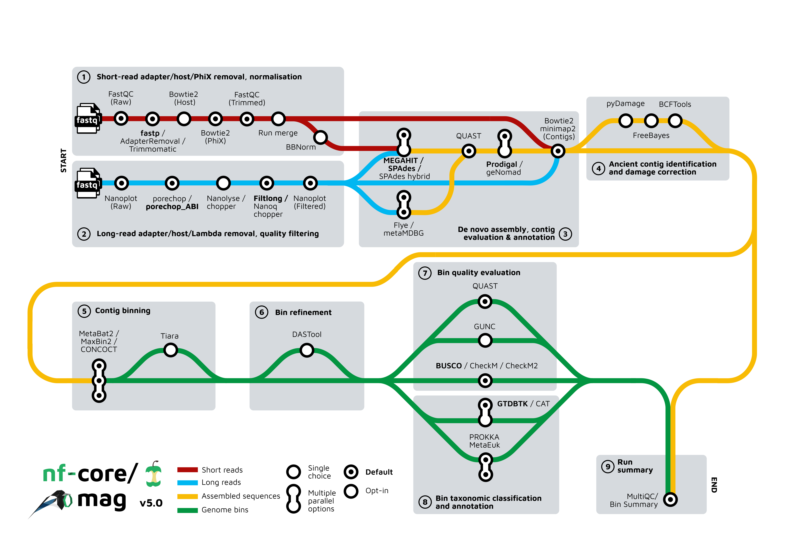

  

  <h1 class="!mb-0">mag v5.0</h1>

**Diego Alvarez S. | [<carbon-logo-github class="inline-block w-4 h-4 mb-0.75" /> dialvarezs](https://github.com/dialvarezs)**

  Universidad de Magallanes

28.10.2025

<!--
-->

---
transition: slide-left
---

# nf-core / mag: Metagenome assembly pipeline

TODO: Diagram | Microorganisms -> Sequencing -> Assembly -> Binning -> MAGs

<!--
-->

---
transition: slide-left
---

# History & Maintainers

## Timeline

🚀

v1.0 - Dec 2019

By <strong>Hadrien Gourlé</strong>

👥

Past maintainers

Sabrina Krakau Maxime Borry

⚡

2024-2025

Major updates v4 & v5

## Current maintainers

James Fellows Yates

<a href="https://github.com/jfy133" target="_blank" class="text-xs opacity-60 hover:opacity-100">@jfy133</a>

Jim Downie

<a href="https://github.com/prototaxites" target="_blank" class="text-xs opacity-60 hover:opacity-100">@prototaxites</a>

Daniel Straub

<a href="https://github.com/d4straub" target="_blank" class="text-xs opacity-60 hover:opacity-100">@d4straub</a>

Adam Rosenbaum

<a href="https://github.com/muabnezor" target="_blank" class="text-xs opacity-60 hover:opacity-100">@muabnezor</a>

Diego Alvarez S.

<a href="https://github.com/dialvarezs" target="_blank" class="text-xs opacity-60 hover:opacity-100">@dialvarezs</a>

+ many other contributors

Thank you all! 🙏

<!--
-->

---
transition: slide-left
---

# What's new?

<h2 class="text-xl m-0">Long read assembly</h2>

Using <strong>Flye</strong> and/or <strong>MetaMDBG</strong>

<h2 class="text-xl m-0">New tools</h2>

Binners: CONCOCT

Bin QC: CheckM, CheckM2

Viral/eukaryotic MAGs: geNomad, Tiara, MetaEuk

<h2 class="text-xl m-0">Updated tools / databases</h2>

Basically everything!

<h2 class="text-xl m-0">Deprecated</h2>

RAW read taxonomic profiling

→ Use <strong>nf-core / taxprofiler</strong> instead

<!--
-->

---
layout: full
transition: slide-left
---

# Current workflow

<!--
-->

---
transition: slide-left
---

# What's next?

## 🚀 v5.1.0 - Coming Soon!

📦

New binner

COMEBin

📚

Documentation

Improvements

🐛

Bug fixes

## Feature Roadmap

| Feature | Status |
|---------|:------:|
| **MetaBinner** support | 🔍 On Review |
| **Bin QC** by multiple tools | 🔍 On Review |
| **nf-test** snapshots | 📋 Planned (hackaton) |

| Feature | Status |
|---------|:------:|
| **BigMAG** compatibility | 🔨 In Progress |
| **Hostile** for contamination | 🔨 In Progress |
| **CoverM** for abundance | 📋 Planned |

<!--
-->

---
layout: center
class: text-center
---

# Thank you!

Questions? Suggestions? Issues?

<carbon-logo-github class="text-4xl mb-2" />

GitHub

<a href="https://github.com/nf-core/mag" target="_blank" class="text-teal-600 dark:text-teal-400 hover:underline">nf-core/mag</a>

<carbon-chat class="text-4xl mb-2" />

Slack

<a href="https://nfcore.slack.com/channels/mag" target="_blank" class="text-teal-600 dark:text-teal-400 hover:underline">#mag</a>

<carbon-document class="text-4xl mb-2" />

Documentation

<a href="https://nf-co.re/mag" target="_blank" class="text-teal-600 dark:text-teal-400 hover:underline">nf-co.re/mag</a>

