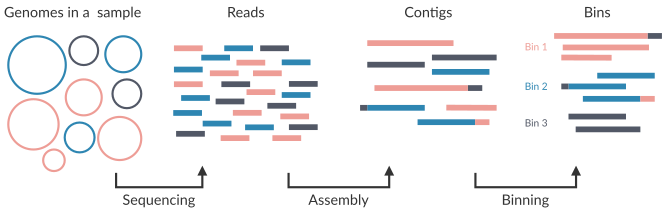
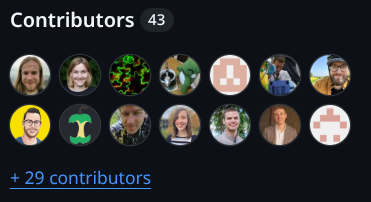
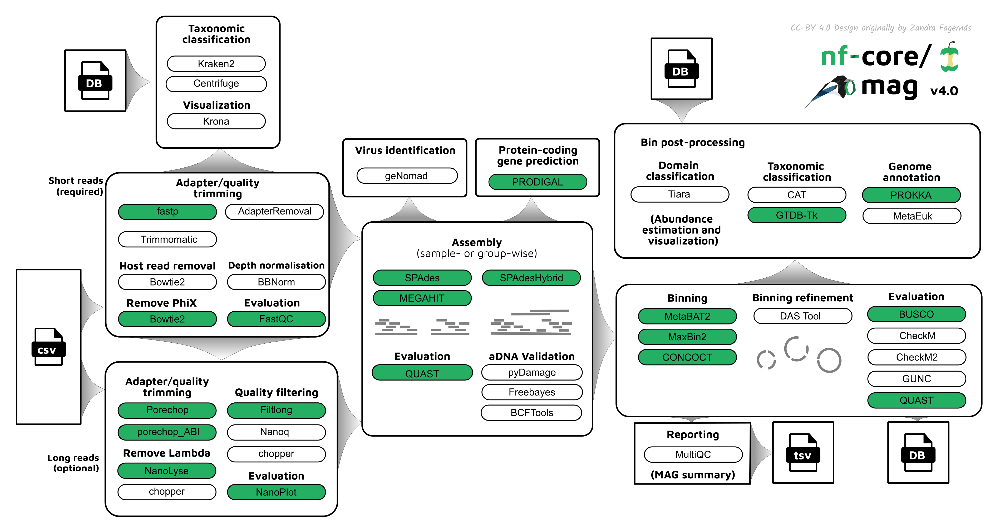
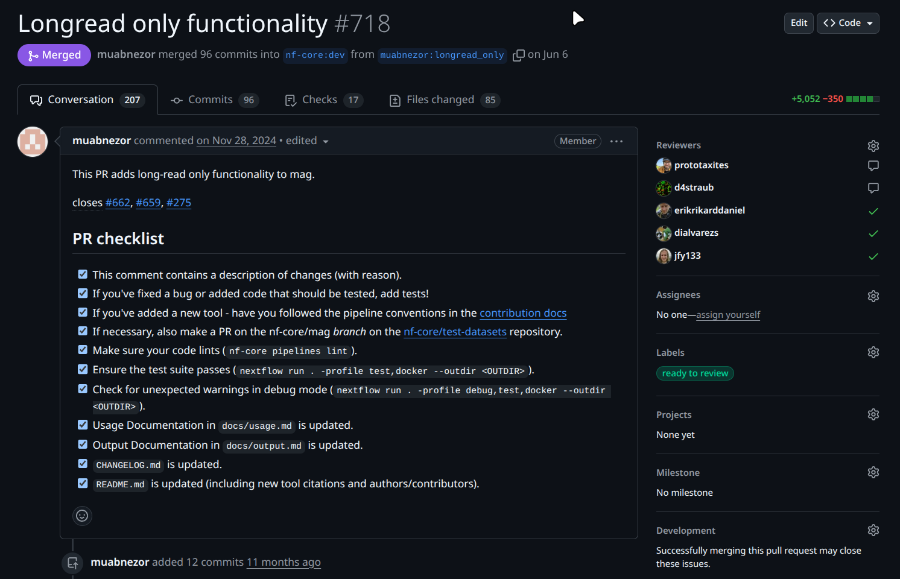
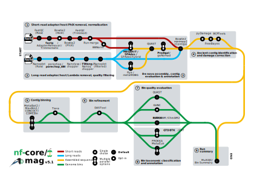
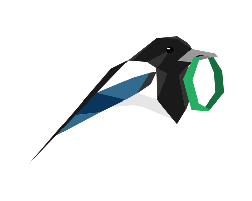

<div class="text-center space-y-2">
  <div></div>
  <h1 class="!mb-0">mag v5</h1>
</div>

<div class="mt-10">

**Diego Alvarez S. | [<carbon-logo-github class="inline-block w-4 h-4 mb-0.75" /> dialvarezs](https://github.com/dialvarezs)**

<p>
  <span class="text-sm opacity-70">Universidad de Magallanes</span>
</p>

</div>

<div class="mt-12">

28.10.2025

</div>

<!--
-->

---
transition: slide-left
---

# Metagenome Assembly & Binning

<div class="mt-24 flex justify-center">

</div>

<!--
-->

---
transition: slide-left
---

# History & Maintainers

<div class="grid grid-cols-[30%_70%] gap-6">

<div class="flex flex-col justify-start">

## Timeline

<div class="space-y-3 text-sm mt-4">

<div class="flex items-start gap-2">
<div class="text-xl">🚀</div>
<div>
<div class="font-bold">v1.0 - Dec 2019</div>
<div class="text-xs opacity-70 italic">Purple Corgi</div>
<div class="text-xs opacity-80">Hadrien Gourlé</div>
</div>
</div>

<div class="flex items-start gap-2">
<div class="text-xl">🚀</div>
<div>
<div class="font-bold">v2.0 - Jun 2021</div>
<div class="text-xs opacity-70 italic">Silver Swan</div>
<div class="text-xs opacity-80">Sabrina Krakau</div>
</div>
</div>

<div class="flex items-start gap-2">
<div class="text-xl">🚀</div>
<div>
<div class="font-bold">v3.0 - May 2024</div>
<div class="text-xs opacity-70 italic">Magenta Magpie</div>
<div class="text-xs opacity-80">James A. Fellows Yates</div>
</div>
</div>

<div class="flex items-start gap-2">
<div class="text-xl">🚀</div>
<div>
<div class="font-bold">v4.0 - May 2025</div>
<div class="text-xs opacity-70 italic">Blue Huemul</div>
<div class="text-xs opacity-80">James A. Fellows Yates</div>
</div>
</div>

<div class="flex items-start gap-2">
<div class="text-xl">🚀</div>
<div>
<div class="font-bold">v5.0 - Sep 2025</div>
<div class="text-xs opacity-70 italic">Green Squirrel</div>
<div class="text-xs opacity-80">James A. Fellows Yates</div>
</div>
</div>

</div>

</div>

<div>

## Current maintainers

<div>

<div class="grid grid-cols-3 gap-3 mt-4">

<div class="text-center">

<div class="text-sm font-bold">James A. Fellows Yates</div>
<a href="https://github.com/jfy133" target="_blank" class="text-xs opacity-60 hover:opacity-100">@jfy133</a>
</div>

<div class="text-center">

<div class="text-sm font-bold">Jim Downie</div>
<a href="https://github.com/prototaxites" target="_blank" class="text-xs opacity-60 hover:opacity-100">@prototaxites</a>
</div>

<div class="text-center">

<div class="text-sm font-bold">Daniel Straub</div>
<a href="https://github.com/d4straub" target="_blank" class="text-xs opacity-60 hover:opacity-100">@d4straub</a>
</div>

</div>

<div class="flex justify-center mt-3">
<div class="grid grid-cols-2 gap-3" style="width: 66.666%;">

<div class="text-center">

<div class="text-sm font-bold">Adam Rosenbaum</div>
<a href="https://github.com/muabnezor" target="_blank" class="text-xs opacity-60 hover:opacity-100">@muabnezor</a>
</div>

<div class="text-center">

<div class="text-sm font-bold">Diego Alvarez S.</div>
<a href="https://github.com/dialvarezs" target="_blank" class="text-xs opacity-60 hover:opacity-100">@dialvarezs</a>
</div>

</div>
</div>

</div>

<div class="mt-4 bg-gray-100 dark:bg-gray-800 rounded-lg p-3">
<div class="grid grid-cols-[auto_1fr_auto] gap-6 items-center">

<div class="text-sm font-bold opacity-70 whitespace-nowrap">Thanks! 🙏</div>

<div class="text-xs">
<span class="font-bold">Past maintainers</span><br />
Hadrien Gourlé, Sabrina Krakau, <br />
Maxime Borry
</div>

<div class="flex items-center gap-2 text-xs">

<span class="whitespace-nowrap">+ many other contributors</span>
</div>

</div>
</div>

</div>

</div>

<!--
-->

---
transition: slide-left
---

# What's New?

<div class="grid grid-cols-2 gap-8 mt-6">

<div class="space-y-6">

<div class="bg-gradient-to-br from-teal-50 to-blue-50 dark:from-teal-900/30 dark:to-blue-900/30 rounded-lg p-4">
<div class="flex items-center gap-3 mb-3">
<h2 class="text-xl m-0">Long read assembly</h2>
</div>
<div class="text-base">Using <strong>Flye</strong> and/or <strong>MetaMDBG</strong></div>
</div>

<div class="bg-gradient-to-br from-teal-50 to-blue-50 dark:from-teal-900/30 dark:to-blue-900/30 rounded-lg p-4">
<div class="flex items-center gap-3 mb-3">
<h2 class="text-xl m-0">New tools</h2>
</div>
<div class="space-y-2 text-sm">
<div><span class="font-bold text-teal-700 dark:text-teal-300">Binners:</span> CONCOCT</div>
<div><span class="font-bold text-teal-700 dark:text-teal-300">Bin QC:</span> CheckM, CheckM2</div>
<div><span class="font-bold text-teal-700 dark:text-teal-300">Viral/eukaryotic MAGs:</span> geNomad, Tiara, MetaEuk</div>
<div><span class="font-bold text-teal-700 dark:text-teal-300">Depth normalisation:</span> BBNorm</div>
</div>
</div>

</div>

<div class="space-y-6">

<div class="bg-gradient-to-br from-teal-50 to-blue-50 dark:from-teal-900/30 dark:to-blue-900/30 rounded-lg p-4">
<div class="flex items-center gap-3 mb-3">
<h2 class="text-xl m-0">Updated tools / databases</h2>
</div>
<div class="text-base font-semibold">Basically everything!</div>
</div>

<div class="bg-gradient-to-br from-red-50 to-orange-50 dark:from-red-900/30 dark:to-orange-900/30 rounded-lg p-5">
<h2 class="text-xl font-bold m-0 mb-3" style="color: #c53939ff !important;">Deprecated</h2>
<div class="text-base font-bold">RAW read taxonomic profiling</div>
<div class="text-sm mt-2">→ Use <strong>nf-core/taxprofiler</strong> instead</div>
</div>

</div>

</div>

<!--
-->

---
transition: slide-left
---

# What's New?


<div class="bg-gradient-to-r from-teal-50 to-blue-50 dark:from-teal-900/30 dark:to-blue-900/30 rounded-xl p-10 max-w-4xl mt-6">

<h2 class="text-center mb-5">🚀 Just Released!</h2>
<h3 class="text-center mb-10">v5.1.0 - <span class="font-italic">Platinum Pudu</span></h3>

<div class="grid grid-cols-3 gap-12">

<div class="flex flex-col items-center text-center">
<div class="text-6xl mb-4">📦</div>
<div class="font-bold text-xl mb-2">New binner</div>
<div class="text-lg">COMEBin</div>
</div>

<div class="flex flex-col items-center text-center">
<div class="text-6xl mb-4">📚</div>
<div class="font-bold text-xl mb-2">Documentation</div>
<div>Usage of</div>
<div class="text-base font-mono bg-gray-200 dark:bg-gray-700 px-2 py-1 rounded mt-1 inline-block">*_percentidentity</div>
</div>


<div class="flex flex-col items-center text-center">
<div class="text-6xl mb-4">🐛</div>
<div class="font-bold text-xl mb-2">Bug fixes</div>
<div class="text-lg opacity-70">metaSPAdes CPUs config, LR assembly mode and more</div>
</div>

</div>

</div>


<!--
-->


---
transition: slide-left
---

# Codebase Improvements

<div class="text-lg mb-8 opacity-80">From v3.0 to v5.0</div>

<div class="grid grid-cols-2 gap-8">

<div class="space-y-6">

<div class="bg-gradient-to-br from-teal-50 to-blue-50 dark:from-teal-900/30 dark:to-blue-900/30 rounded-xl p-4">
<div class="flex items-center gap-3 mb-2">
<div class="text-4xl">📝</div>
<div>
<div class="text-3xl font-bold">1,106</div>
<div class="text-sm opacity-80">commits</div>
</div>
</div>
</div>

<div class="bg-gradient-to-br from-teal-50 to-blue-50 dark:from-teal-900/30 dark:to-blue-900/30 rounded-xl p-4">
<div class="flex items-center gap-3 mb-2">
<div class="text-4xl">📂</div>
<div>
<div class="text-3xl font-bold">626</div>
<div class="text-sm opacity-80">files changed</div>
</div>
</div>
</div>

<div class="bg-gradient-to-br from-teal-50 to-blue-50 dark:from-teal-900/30 dark:to-blue-900/30 rounded-xl p-4">
<div class="flex items-center gap-3 mb-2">
<div class="text-4xl">🧩</div>
<div>
<div class="text-3xl font-bold">-23</div>
<div class="text-sm opacity-80">local modules (migrated to nf-core ones)</div>
</div>
</div>
</div>

</div>

<div class="space-y-6">

<div class="bg-gradient-to-br from-teal-50 to-blue-50 dark:from-teal-900/30 dark:to-blue-900/30 rounded-xl p-4">
<div class="flex items-center gap-3 mb-2">
<div class="text-4xl">➕</div>
<div>
<div class="text-3xl font-bold text-green-600 dark:text-green-400">50,417</div>
<div class="text-sm opacity-80">additions</div>
</div>
</div>
</div>

<div class="bg-gradient-to-br from-teal-50 to-blue-50 dark:from-teal-900/30 dark:to-blue-900/30 rounded-xl p-4">
<div class="flex items-center gap-3 mb-2">
<div class="text-4xl">➖</div>
<div>
<div class="text-3xl font-bold text-red-600 dark:text-red-400">10,678</div>
<div class="text-sm opacity-80">deletions</div>
</div>
</div>
</div>


<div class="bg-gradient-to-br from-teal-50 to-blue-50 dark:from-teal-900/30 dark:to-blue-900/30 rounded-xl p-4">
<div class="flex items-center gap-3 mb-2">
<div class="text-4xl">⚙️</div>
<div>
<div class="text-3xl font-bold">11</div>
<div class="text-sm opacity-80">new subworkflows</div>
</div>
</div>
</div>

</div>

</div>

---
layout: full
transition: slide-left
---

# Previous Workflow (v4.0)

<div class="mt-2 flex justify-center">

</div>

<!--
-->

---
transition: slide-left
layout: two-cols-header
---

# Longread only PR by @muabnezor

::left::
<div class="bg-gradient-to-br from-teal-50 to-blue-50 dark:from-teal-900/30 dark:to-blue-900/30 rounded-xl p-5">

- **Complete rebuild** of the pre-processing and assembly subworkflows
- **New tools** specific for long reads
- **New parameters**

</div>

<div class="bg-gradient-to-br from-teal-50 to-blue-50 dark:from-teal-900/30 dark:to-blue-900/30 rounded-xl p-5 mt-3">

- **~100 commits**
- **~5000 new lines**
- **~6 months** of development
- **200+ comments**

</div>


::right::



<style>
.slidev-layout.two-cols-header {
  grid-template-columns: 40% 60% !important;
  column-gap: 1rem !important;
}
</style>

<!--
-->

---
layout: full
transition: slide-left
---

# Current Workflow (v5.1)

<div class="mt--15 flex justify-center">

</div>

<!--
-->

---
layout: full
transition: slide-left
---

# nf-core/mag v5.1 - Preprocessing

<div class="flex items-center justify-center h-full">
  <div style="width: 75%; height: 420px; overflow: hidden; position: relative;">
    
  </div>
</div>

<!--
-->

---
layout: full
transition: slide-left
---

# nf-core/mag v5.1 - Assembly and Annotation

<div class="flex items-center justify-center h-full">
  <div style="width: 90%; height: 310px; overflow: hidden; position: relative;">
    
  </div>
</div>

<!--
-->

---
layout: full
transition: slide-left
---

# nf-core/mag v5.1 - Binning and Refinement

<div class="flex items-center justify-center h-full">
  <div style="width: 80%; height: 300px; overflow: hidden; position: relative;">
    
  </div>
</div>

<!--
-->

---
layout: full
transition: slide-left
---

# nf-core/mag v5.1 - Bin QC and Taxonomy

<div class="flex items-center justify-center h-full">
  <div style="width: 27%; height: 450px; overflow: hidden; position: relative;">
    
  </div>
</div>

<!--
-->

---
transition: slide-left
---

# How to run nf-core/mag v5.1.0?

```bash
nextflow run nf-core/mag -r 5.1.0 \
  -profile <docker/singularity/.../institute> \
  --input samplesheet.csv \
  --outdir results/
```

Mixed short + long read samplesheet

```csv
sample,group,short_reads_1,short_reads_2,long_reads,short_reads_platform,long_reads_platform
sample1,0,data/sample1_R1.fastq.gz,data/sample1_R2.fastq.gz,data/sample1.fastq.gz,ILLUMINA,OXFORD_NANOPORE
sample2,0,data/sample2_R1.fastq.gz,data/sample2_R2.fastq.gz,data/sample2.fastq.gz,ILLUMINA,OXFORD_NANOPORE
sample3,1,data/sample3_R1.fastq.gz,data/sample3_R2.fastq.gz,,ILLUMINA,
```

Long read only, merging runs
```csv
sample,run,group,long_reads,long_reads_platform
sample1,1,0,data/sample1a.fastq.gz,OXFORD_NANOPORE
sample1,2,0,data/sample1b.fastq.gz,OXFORD_NANOPORE
sample2,0,0,data/sample2.fastq.gz,OXFORD_NANOPORE
sample3,1,0,data/sample3.fastq.gz,OXFORD_NANOPORE
```

<!--
-->

---
transition: slide-left
---

# What's Next?


| Feature                           | Planned | In Progress | On Review |
| --------------------------------- | :-----: | :---------: | :-------: |
| **MetaBinner**                    |    ✅    |      ✅      |     ✅     |
| **Bin QC by multiple tools**      |    ✅    |      ✅      |     ✅     |
| **BigMAG** compatibility          |    ✅    |      ✅      |           |
| **Hostile** for decontamination   |    ✅    |      ✅      |           |
| **nf-test** snapshots (Hackaton!) |    ✅    |      ✅      |           |
| **CoverM** for bin abundance      |    ✅    |             |           |


<!--
-->

---
layout: center
class: text-center
---

<div>

</div>

# Thank you!

<div class="mt-12 space-y-8">

<div class="text-xl opacity-80">
Questions? Suggestions? Issues?
</div>

<div class="flex justify-center gap-12 text-lg">

<div>
<carbon-logo-github class="text-4xl mb-2" />
<div class="font-bold">GitHub</div>
<a href="https://github.com/nf-core/mag" target="_blank" class="text-teal-600 dark:text-teal-400 hover:underline">nf-core/mag</a>
</div>

<div>
<carbon-chat class="text-4xl mb-2" />
<div class="font-bold">Slack</div>
<a href="https://nfcore.slack.com/channels/mag" target="_blank" class="text-teal-600 dark:text-teal-400 hover:underline">#mag</a>
</div>

<div>
<carbon-document class="text-4xl mb-2" />
<div class="font-bold">Documentation</div>
<a href="https://nf-co.re/mag" target="_blank" class="text-teal-600 dark:text-teal-400 hover:underline">nf-co.re/mag</a>
</div>

</div>

</div>
